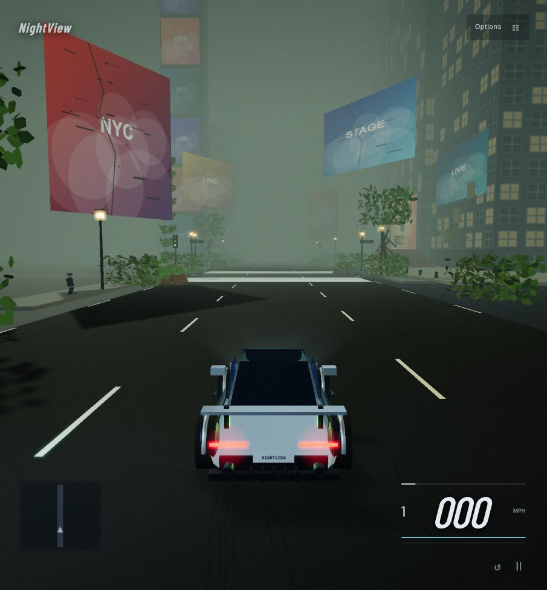
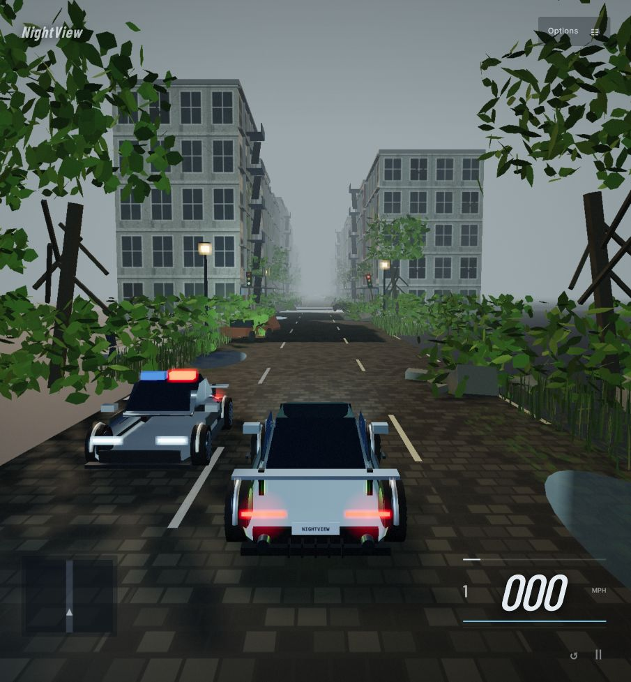
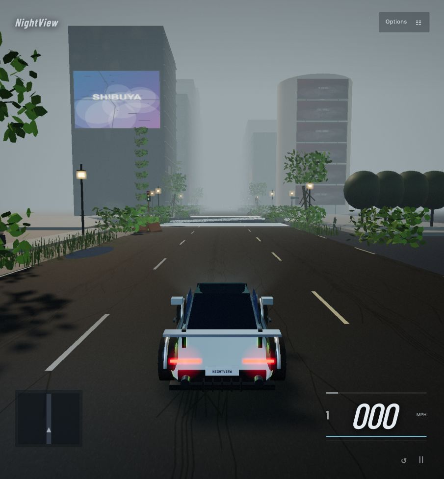

<p align="center">
  
</p>

<p align="center">
  <a href="#quick-start">Quick start</a> ·
  <a href="#the-world">Locations</a> ·
  <a href="#controls">Controls</a> ·
  <a href="PHYSICS.md">Vehicle dynamics</a> ·
  <a href="#roadmap">Roadmap</a>
</p>

<p align="center">
  
  
  
  
</p>

NightView is a browser arcade driving game set in cities overtaken by foliage, fog and decay. Drive through three districts with traffic, police patrols, pedestrians and collapsing facades. A brief **GitHub / sormazi** introduction fades directly into driving; vehicle and location selection live in **Options**.

Built with original procedural scenes, a vendored Three.js renderer and a standalone force-based vehicle simulation. The project is actively being developed.

<p align="center"></p>

## Quick start

Requires **Python 3**, a browser with **WebGL 2**, and **Node.js 24+** for the tests. There is no package installation or API-key setup.

```bash
git clone https://github.com/sormazi/NightView.git
cd NightView
python3 -m http.server 4173 --directory dist
```

Open **http://localhost:4173**. Click the game or use a driving key to enable sound. You can also run `npm start` from the repository root.

```bash
npm test
```

The app is static. The GitHub repository contains the playable files; GitHub Pages deployment is not configured.

## The world

| Location | District features |
| :--- | :--- |
| **Times Square · New York** | Illuminated tower, damaged displays, plaza steps and avenue crossings |
| **SoHo · New York** | Cast-iron facades, storefronts, fire escapes and a narrower cobbled corridor |
| **Shibuya · Tokyo** | Scramble crossing, glass towers, rounded commercial corner and dense signage |

| Times Square | SoHo | Shibuya |
| :---: | :---: | :---: |
|  |  |  |

Screenshots captured from the current playable build.

All three feature overgrowth, masonry debris, wrecks, animated pedestrians, cycling signals and moving traffic. Police vehicles patrol with flashing roof lights. Choose **Overgrown daylight**, **Ash storm** or **Dusty dawn** in Options.

These are original arcade interpretations based on licensed reference photos, **not one-to-one geographic replicas**. Billboard artwork, dimensions and routes are approximate or invented. Each district is a repeating driving corridor; side streets are scenic. No Google Maps or Street View integration is used. [Reference credits →](dist/credits.html)

## Driving and presentation

- **Three vehicles** with distinct mass, torque, grip and drivetrain configurations.
- **120 Hz physics** with independent interpolated rendering and bounded frame-stall catch-up.
- **Force-based handling:** wheel inertia, tire slip, combined traction limits, load transfer, spring-damper suspension, engine/clutch/gears and impulse contacts.
- **Arcade tuning:** speed-sensitive steering, capped stability assistance, boost, handbrake drifts and rolling burnouts.
- **Persistent damage**, impact sparks, skid marks and synthesized engine/tire audio.
- **Atmosphere:** dense fog, facade sections that fall as you approach, foliage and speed-driven motion blur.

The custom solver is documented in [PHYSICS.md](PHYSICS.md). It is **not Unreal Engine or Chaos**. Suspension and collision geometry are simplified; production handling still needs playtesting and tuning. Falling facade debris is currently cosmetic. Police patrols do not implement pursuit AI.

## Controls

| Action | Keyboard |
| :--- | :--- |
| Accelerate / brake / reverse | **W / S** or **↑ / ↓** |
| Steer | **A / D** or **← / →** |
| Handbrake | **Space** |
| Boost | **Shift** |
| Clutch / free rev | **C + W** |
| Rolling burnout | **W + S** |
| Shift down / up in manual mode | **Q / E** |
| Reset and repair | **R** |
| Pause | **Esc** |

Touch driving buttons are provided on smaller screens. Transmission, atmosphere, traffic density and sound settings are available in **Options → Driving**.

## Roadmap

- [x] Playable browser build and three procedural districts
- [x] Standalone fixed-step vehicle dynamics
- [x] Fog, foliage, facade destruction and motion effects
- [ ] More detailed location geometry and recognizable landmarks
- [ ] Better crowd navigation, traffic rules and police pursuit
- [ ] Handling playtests, wider device coverage and performance profiling
- [ ] Richer vehicle damage, suspension and collision geometry
- [ ] Additional districts and race modes
- [ ] Evaluate native Unreal or Pixel Streaming delivery

## Development

| Path | Purpose |
| :--- | :--- |
| `dist/physics.js` | Standalone vehicle solver and fixed-step loop |
| `dist/game.js` | Inputs, session state, contacts and UI |
| `dist/renderer3d.js` | Three.js vehicles, camera, lighting and postprocessing |
| `dist/locations.js` | Location metadata and streetscape builders |
| `dist/aftermath.js` / `destruction.js` | World population, overgrowth and collapse effects |
| `dist/traffic.js` | Shared traffic poses for physics and rendering |
| `tests/` | Dynamics, timing, traffic and world regression checks |

Read [CONTRIBUTING.md](CONTRIBUTING.md) to keep working on the project. Test coverage includes deterministic replay, 30/60/144 Hz equivalence, tire force bounds, braking, load transfer, collision energy and a 200-second stability replay. [Validation notes →](VALIDATION.md)

## Reclamation pipeline

The development build now includes reusable surface weathering, facade ivy, seam grasses with wind, moss decals, puddles, shop shutters, physical billboard supports and location-specific story profiles. See [ENVIRONMENT.md](ENVIRONMENT.md) for implementation and remaining visual-quality limits.

## Environmental advertising

World-space advertisements now use documented archival Coca-Cola, Kodak and Mitsukoshi artwork, with location-aware placement, surface weathering and mostly failed digital displays. Inspect assets or disable real brands in **Options → Driving → Advertising inspector**. No companies sponsor or endorse NightView. These are fictional archival placements, not surveyed campaigns. [System and asset policy →](ADVERTISING.md) · [Asset manifest →](dist/assets/ads/manifest.json)
