<p align="center">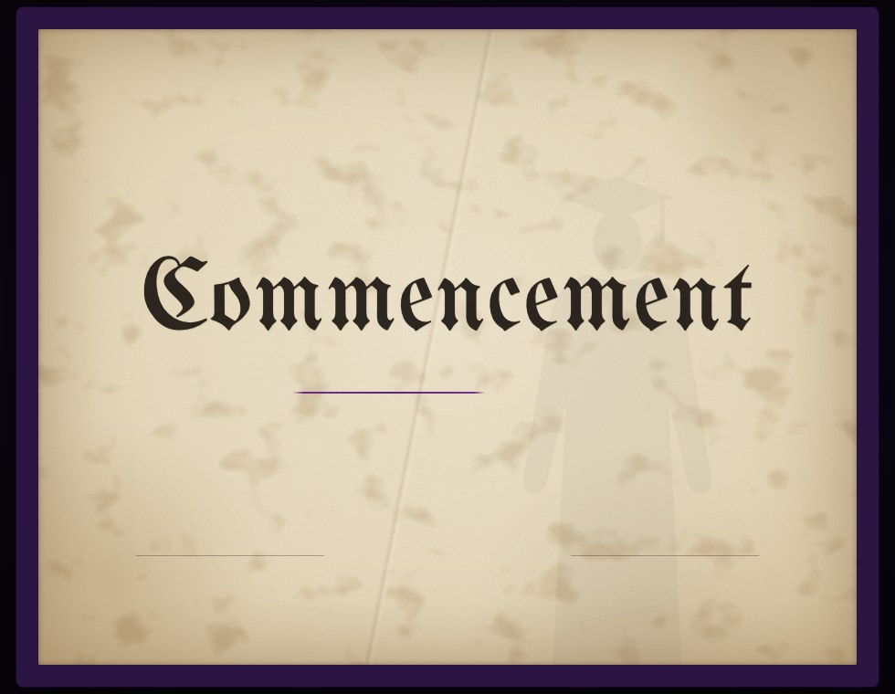</p>

<h1 align="center">Commencement</h1>

<p align="center"><a href="https://sormazi.github.io/Commencement/"></a></p>

<p align="center">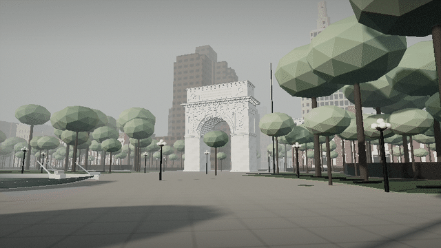</p>

At some point I started wondering what WSQ would look like if everyone just stopped showing up. Not a disaster. Nothing blows up. The university runs out of reasons to exist, the city stops mowing, and a hundred years go by.


You drive a Campus Safety car, which as far as anyone can tell is the last vehicle on campus that still starts, through the square and the streets around it in 2126. Trees have pushed up through the paths. Ivy has climbed most of the buildings. The street lamps mostly don't work, and the light follows the real time in New York, so if you play at two in the morning it's two in the morning in the game too.

It isn't empty, though. People still stand around the park and wait in lines outside buildings that are never going to open again. Most of them ignore you. A few turn their heads as you drive past. I don't know what they're waiting for either.

The game started life as NightView, an arcade driver I made earlier, and slowly turned into this.

## The place

The game keeps two versions of the neighborhood: the campus as it looks today and the same streets a century later. You can switch between them from the options menu, which is currently a debugging option that wouldn't exist in the final version. The final version looks to incorporate the two eras together in the narrative and the user would not typically be able to switch between the two. For now the game opens in 2026; set the year to 2126 to see the ruin.

| 2026 | 2126 |
| :---: | :---: |
| 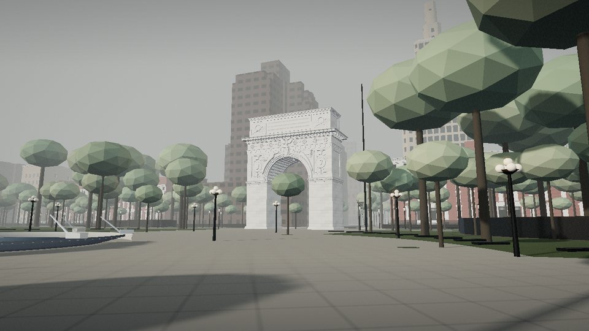 | 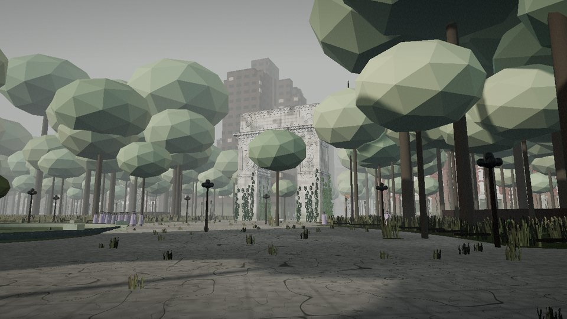 |
| The Arch from the fountain | |
| 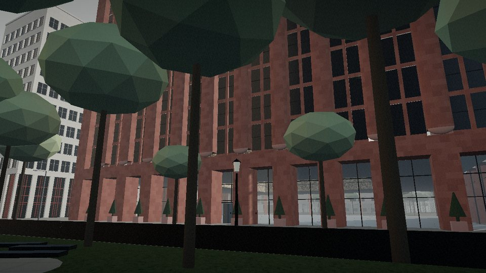 | 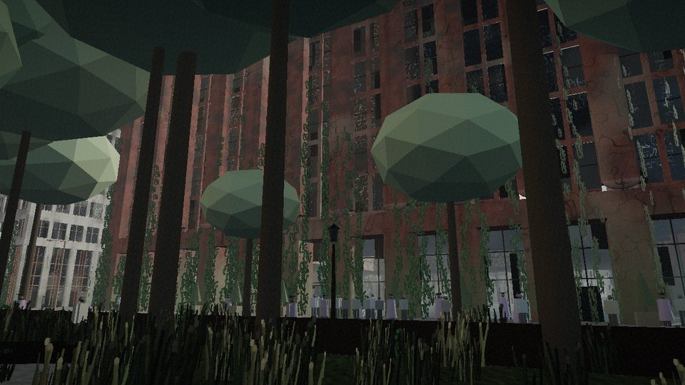 |
| Bobst, from the park | |
| 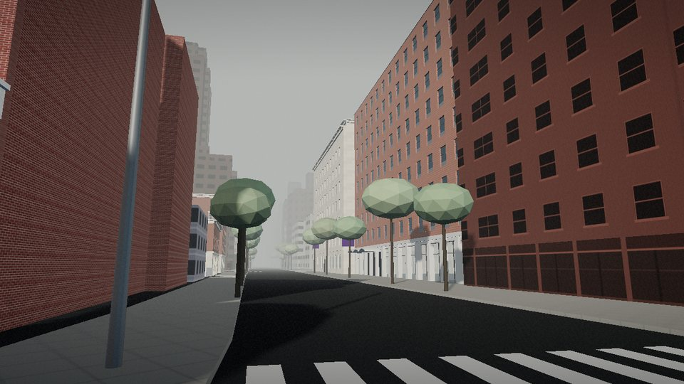 | 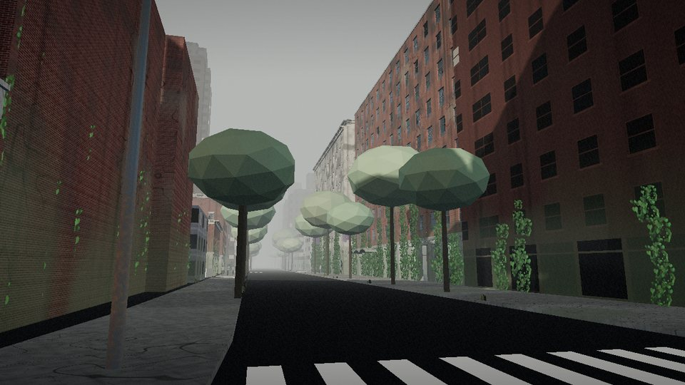 |
| Weinstein, on University Place | |
| 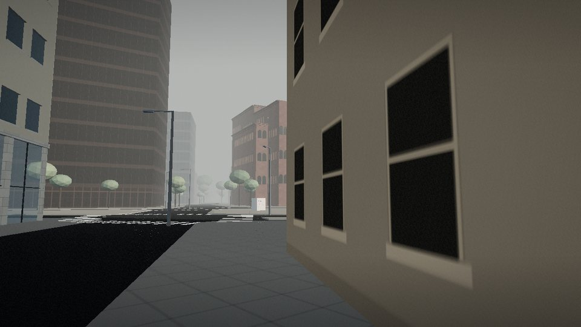 | 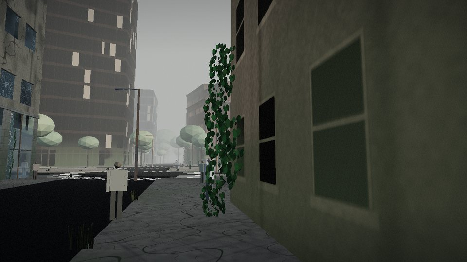 |
| Astor Place, looking at Cooper Union | |

One building doesn't decay. The Brown Building, where 146 garment workers died in the Triangle Shirtwaist Factory fire in 1911, stays clean and intact, along with the memorial that names them.

## Around the neighborhood

| | |
| :---: | :---: |
| 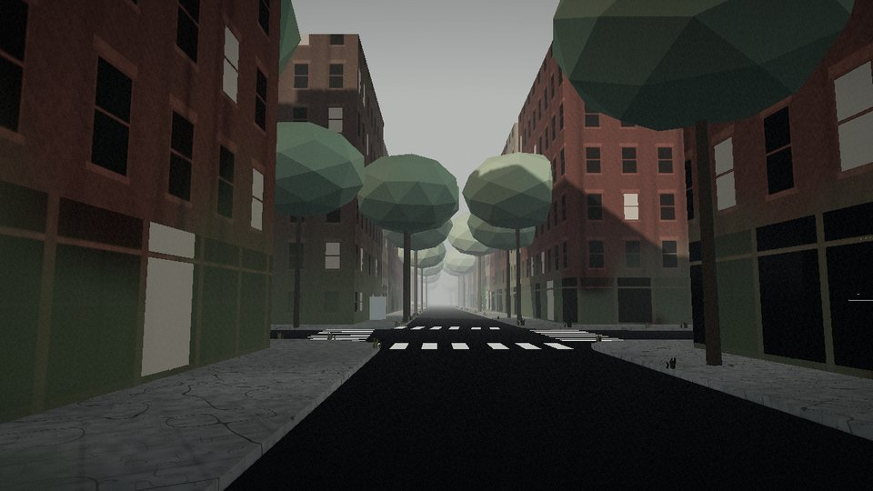 | 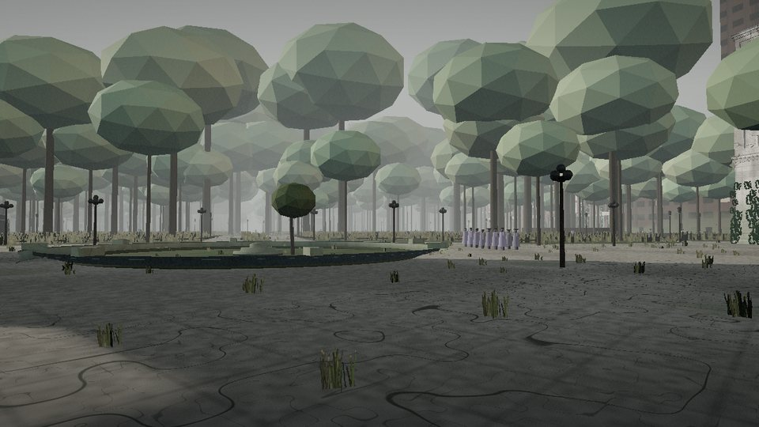 |
| MacDougal and Bleecker | The fountain, and the class that never left |
| 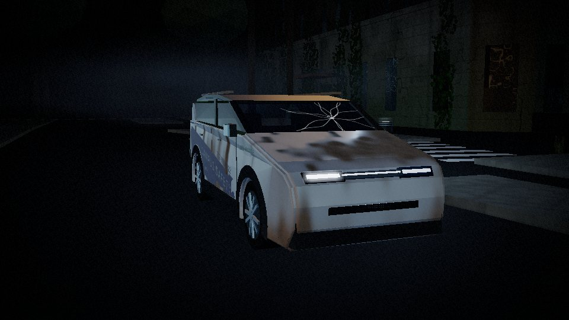 | 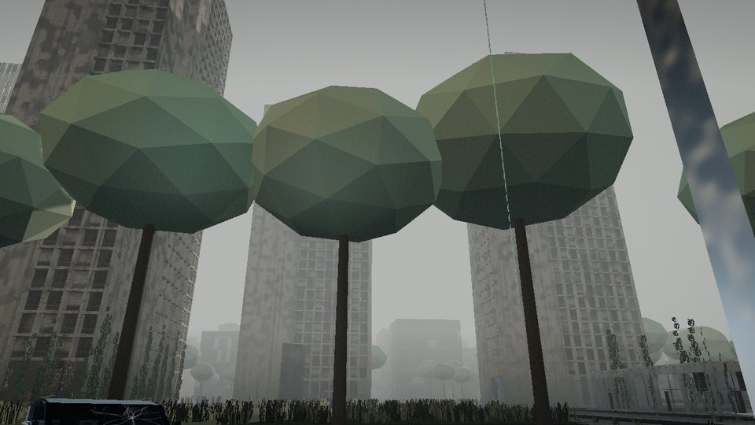 |
| Unit 4, still on patrol | Silver Towers |
| 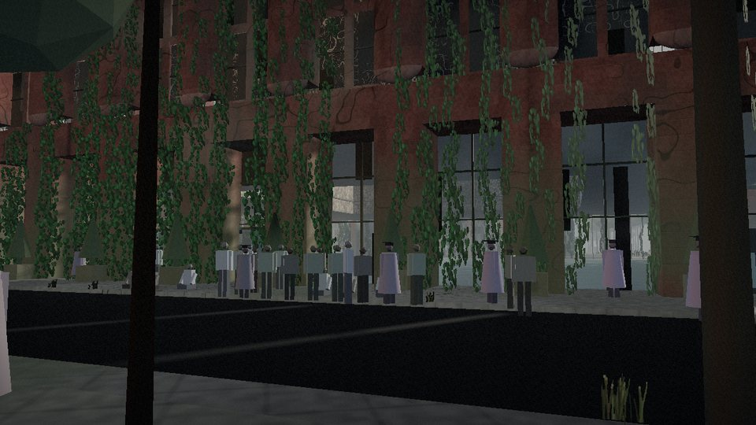 | |
| Still waiting for Bobst to open | |

## How close is it to the real thing?

As close as I could get it. The streets are the real streets at their real widths, and every building sits on its real footprint at its real height, taken from New York City's public map data and OpenStreetMap. The buildings that matter most were rebuilt one at a time from photos, from Street View, and from a lot of standing on the sidewalk squinting at cornices. The shops on the main streets are being filled in with the real ones, under their real names. It's still a game, so plenty is simplified, but if you know the neighborhood you should be able to find your way around without a map.

## Controls

| | |
| :--- | :--- |
| Drive and brake, or reverse | W / S or the arrow keys |
| Steer | A / D or the arrow keys |
| Parking brake | Space |
| Put the car back on the street | R |
| Pause | Esc |

Sound starts after you click or press a key. The options menu (top right) has the time of day, the year, sound, music and an FPS counter.

## Run it yourself

You need Python 3 and a browser that does WebGL 2, which is any recent one.

```bash
git clone https://github.com/sormazi/Commencement.git
cd Commencement
python3 tools/serve.py
```

Then open http://localhost:4173. If something else is already using that port, run `python3 tools/serve.py 4180` and open http://localhost:4180 instead.

## What's coming

- The shops along MacDougal, Bleecker, West 4th, Broadway, University Place, 8th Street and Astor Place, with their real names
- A soundtrack: one old New York jazz piece, played clean in 2026 and off a worn-out cassette in 2126
- A slower camera, a field guide to the buildings, and small things to find
- Getting out of the car and walking, starting with the Bobst atrium
- Starting the game in 2026 and watching it turn into 2126 while you drive
- A photo mode

---

Map data © OpenStreetMap contributors (ODbL) and NYC Open Data. Reference photos are from Wikimedia Commons and are credited, along with everything else, in [the credits](dist/credits.html). This is a made-up ruin and isn't affiliated with or endorsed by NYU.
